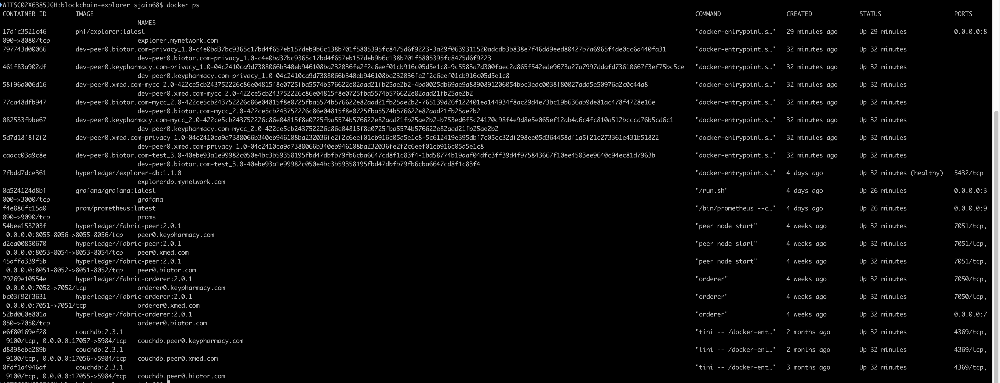
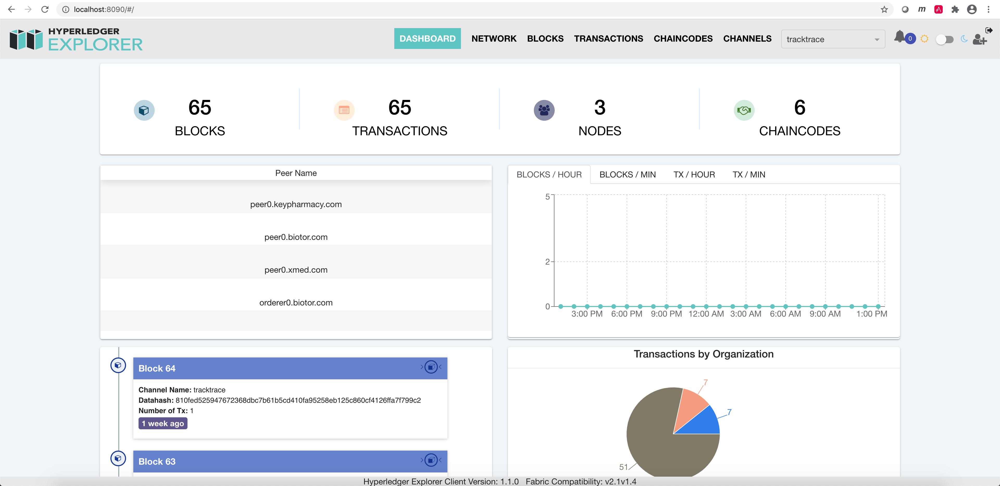
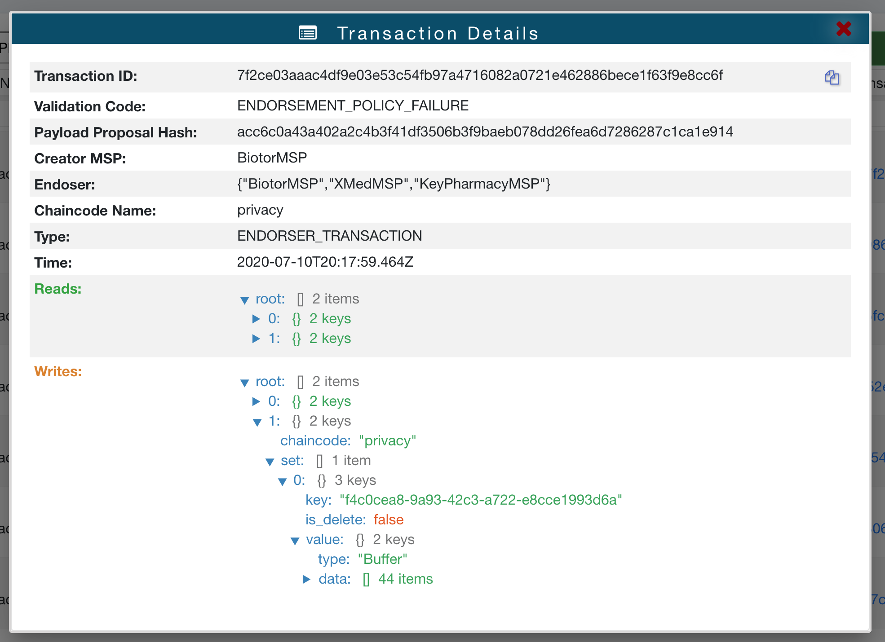
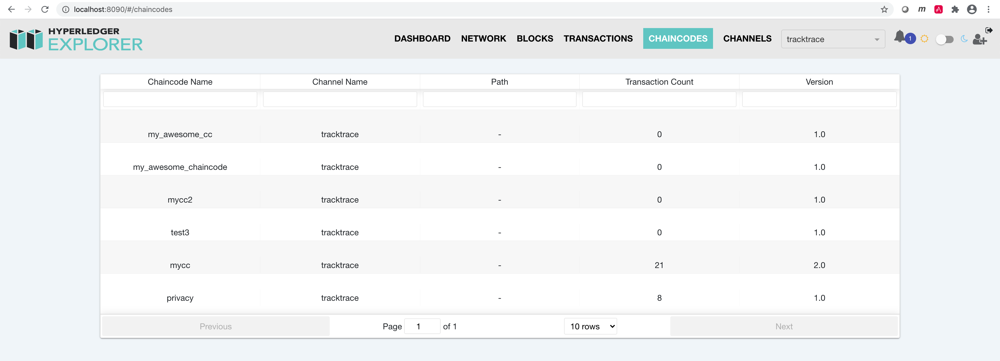
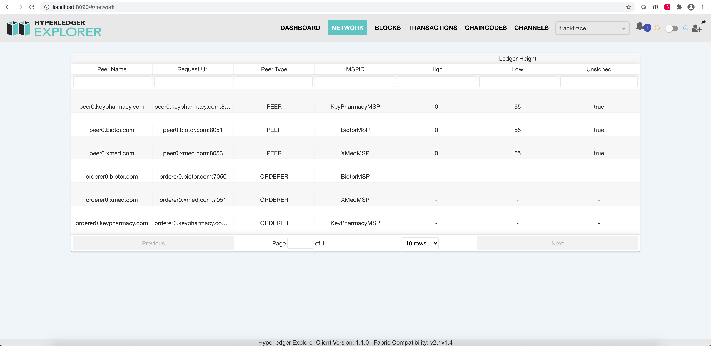
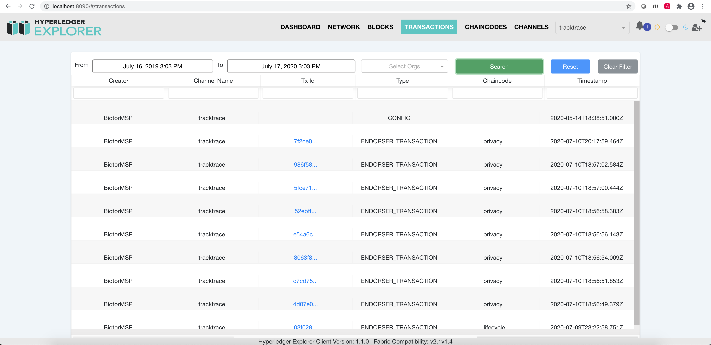
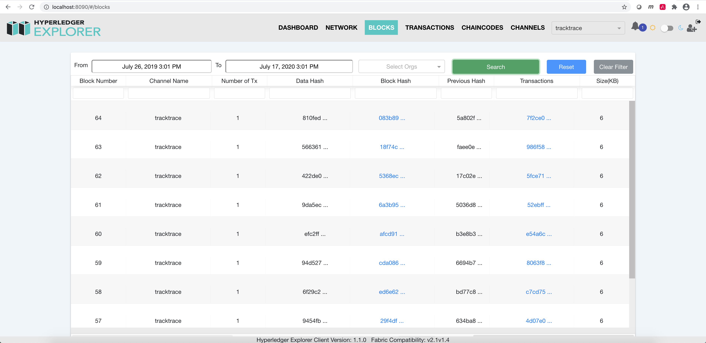
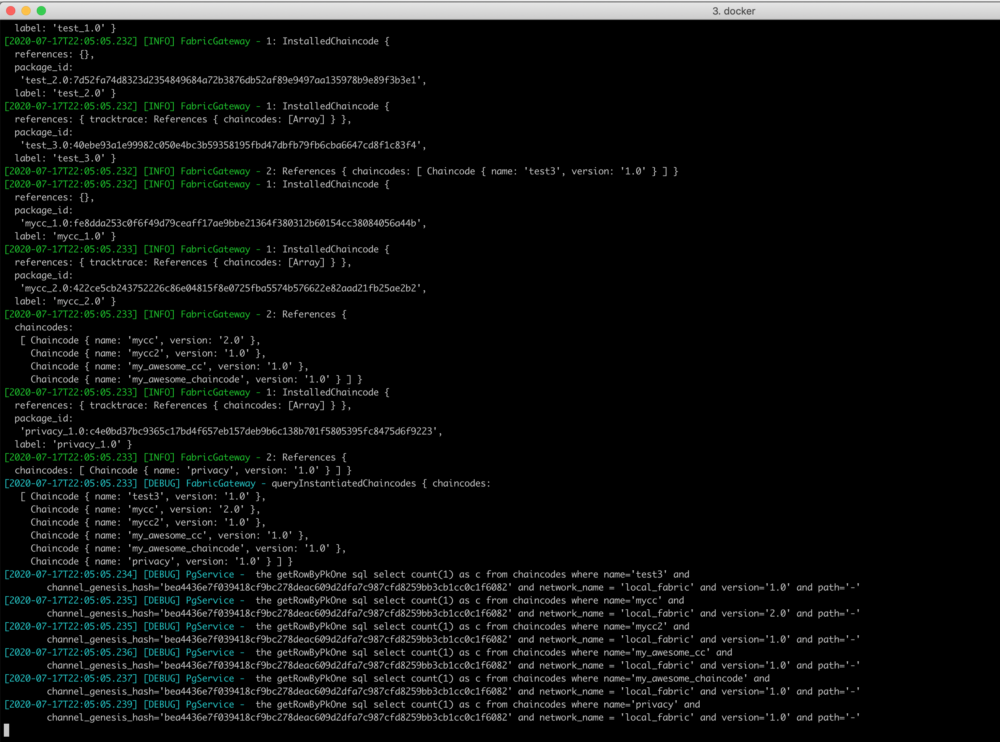
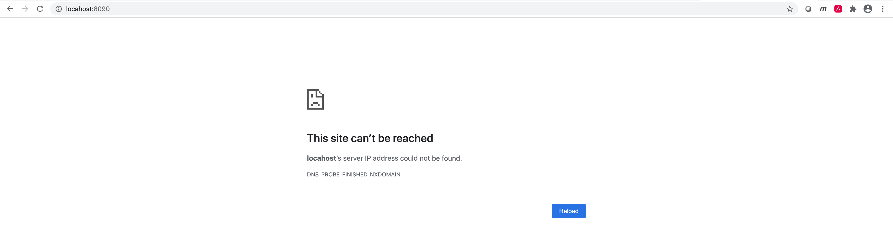

# Getting Started

## Build Docker Images

I have used a private [fork](https://github.com/siddjain/blockchain-explorer) of Hyperledger Explorer to get it to work.
The first step is to build the Docker images of that private fork. This is done as follows:

1. Clone the private [fork](https://github.com/siddjain/blockchain-explorer)
2. Build the docker images by running:

```
$ ./build_docker_image.sh
```

3. This will build two images:

```
FABRIC_EXPLORER_DB_TAG="phf/explorer-db"
FABRIC_EXPLORER_TAG="phf/explorer"
```

The next step is to run the 3-org network that comes with the book.

## Run Explorer

* Open [docker-compose.yaml](docker-compose.yaml) and change the network name from `pharmanet` to whatever docker network your Fabric containers are attached to. Double check volume mounts.
* Open [local_fabric.json](local_fabric.json) and edit paths to `adminPrivateKey` and `signedCert` so that they point to correct files on your system. The `local_fabric.json` gets mounted to the
explorer container as `./local_fabric.json:/opt/explorer/app/platform/fabric/local_fabric.json` as specified in [docker-compose.yaml](docker-compose.yaml)
* Also edit peer connection urls and other settings if necessary

To bring up the explorer:

```
$ ./run-explorer.sh
```

Above script will only create a container if it is not already created. Thus it will not create a container if one was created from a previous run. Above script will automatically download all the 
necessary docker images if you don't have them already. It can take a while so be patient.

`docker ps` should show a screen similar to following:



To tear down:
```
$ docker-compose -f docker-compose.yaml down -v
```

It should show you a screen that looks like following



You can drill down into a transaction and inspect its details



To see what chaincodes are installed go to chaincodes tab



Network Tab



Transactions Tab



Blocks Tab



Explorer Logs:



# Troubleshooting

Sometimes I have seen following screen:



Not sure why it happens as you can run `nc -zv localhost 8090` and verify it returns success. 

```
WITSC02X6385JGH:blockchain-explorer sjain68$ nc -zv localhost 8090
found 0 associations
found 1 connections:
     1:	flags=82<CONNECTED,PREFERRED>
	outif lo0
	src ::1 port 53950
	dst ::1 port 8090
	rank info not available
	TCP aux info available

Connection to localhost port 8090 [tcp/*] succeeded!
```

I have been able to fix it by closing all explorer tabs and opening a new one again.